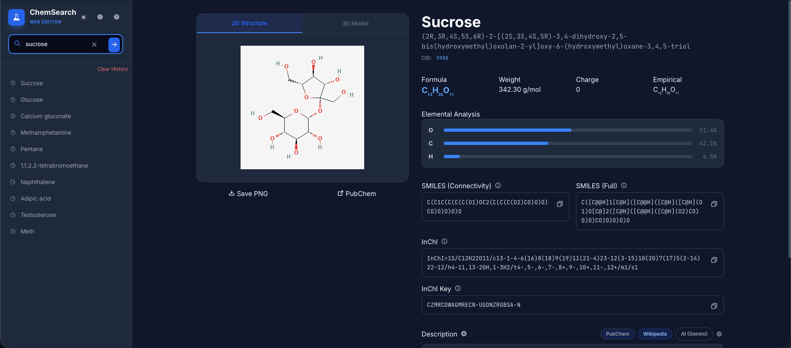
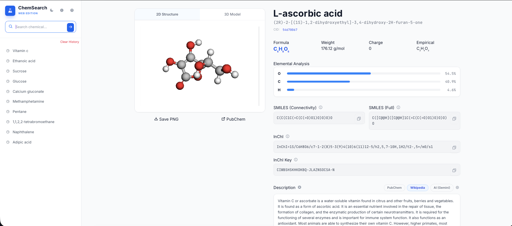

# ChemSearch

**A clean, fast, single-file web app for instant chemical compound lookup.**

ChemSearch pulls live data from **PubChem**, shows beautiful 2D/3D structures, all major identifiers, elemental analysis, and gives you **three smart description sources**: PubChem, **Wikipedia**, and **AI (Gemini)**.

**[Live Demo → https://chemsearch.netlify.app](https://chemsearch.netlify.app)**

---

## ✨ Features

- **Smart Search + Autosuggestions** – Real-time dropdown powered by PubChem as you type
- **Rich Identifiers** – SMILES (Connectivity + Full), **InChI**, InChI Key, formula, weight, charge & empirical formula
- **Visuals** – High-resolution 2D PNG + fully interactive 3D model (3Dmol.js)
- **Elemental Analysis** – Beautiful percentage bar chart with precise atomic weights
- **Multiple Description Sources**
  - PubChem (official)
  - Wikipedia (clean first-paragraph summary)
  - AI (Gemini) with LaTeX support
- **Default Description Setting** – Choose your preferred source (saved forever)
- **Feedback Button** – Send suggestions or bug reports instantly via Formspree
- **History** – Recent searches saved in browser (`localStorage`)
- **Utilities** – One-click copy, PNG download, direct PubChem link
- **Theme** – Light / Dark mode
- **Mobile-friendly** – Works perfectly on phones and tablets

---

## 🚀 Usage

1. Open the [live demo](https://chemsearch.netlify.app) or `index.html`
2. Start typing a compound name (e.g. `aspirin`, `caffeine`, `pentane`)  
   → Real-time suggestions appear instantly
3. Press **Enter** or click the arrow
4. Switch between **2D** and **3D** tabs
5. Click the ⚙️ gear next to “Description” to set your default source
6. Use the ℹ️ icons for quick explanations

**Pro tip:** Your default source, search history, and Gemini API key are saved locally in your browser.

---

## 🔧 Description Sources

| Source          | Type                  | Speed      | API Key Needed | Notes                              |
|-----------------|-----------------------|------------|----------------|------------------------------------|
| **PubChem**     | Official              | Instant    | No             | Default                            |
| **Wikipedia**   | Community summary     | Instant    | No             | Clean first paragraph              |
| **AI (Gemini)** | Generated             | ~2–4 sec   | Yes            | Readable + real-world uses + LaTeX |

---

## 📸 Screenshots

<table>
  <tr>
    <td></td>
    <td></td>
  </tr>
</table>

---

## 📁 Files

- **`index.html`** – Complete single-page app (Tailwind + everything)
- **`script.js`** – All logic (PubChem, Wikipedia, Gemini, autosuggestions, feedback, etc.)
- **`style.css`** – Extra styles (included inline in HTML)

---

## 🛠️ Libraries & Credits

- **PubChem PUG REST API** – Chemical data & autocomplete  
  https://pubchem.ncbi.nlm.nih.gov/
- **Wikipedia REST API** – Short descriptions  
  https://en.wikipedia.org/api/rest_v1/
- **Google Gemini** – Optional AI descriptions  
  https://developers.generativeai.google/
- **Tailwind CSS** – Styling
- **3Dmol.js** – Interactive 3D viewer
- **KaTeX** – LaTeX rendering in AI descriptions
- **Phosphor Icons** – Beautiful icons
- **Formspree** – Feedback form submissions

**Please cite PubChem and Wikipedia** when using data from this app.

---

## 📝 Notes

- Fully static — no server or build step required
- Works offline after first load (except live API calls)
- Recommended to serve locally (`npx serve` or VS Code Live Server) to avoid CORS issues
- All settings and API keys stay **only in your browser**

---

## 📄 License

Open-source. See the `LICENSE` file for details.

---
