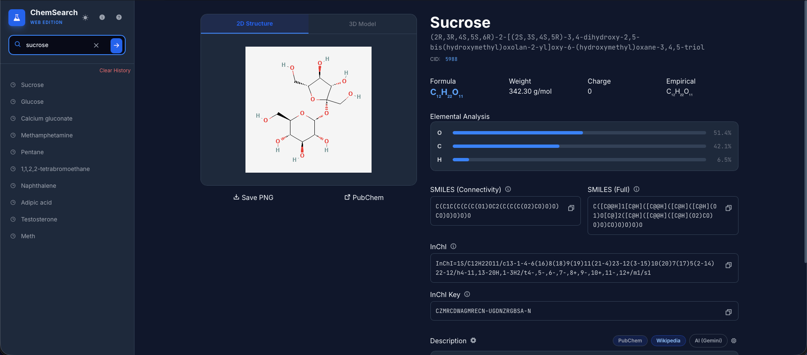
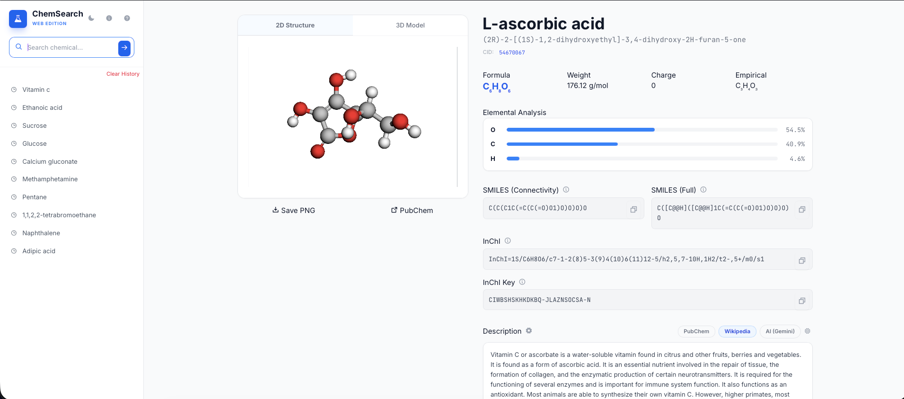

# ChemSearch

> A fast, clean web app for instant chemical compound lookup — powered by PubChem, Wikipedia and Gemini AI.

**[Live Demo → chemsearch.netlify.app](https://chemsearch.netlify.app)**



---

## What it does

Type any compound name and ChemSearch pulls live data from PubChem in under a second which gives you the full identifier set, a visual 2D/3D structure, elemental composition breakdown and a description from your choice of three sources.

---

## Features

**Search**
- Real-time autosuggestions as you type (PubChem autocomplete API)
- Recent search history saved locally
- Keyboard shortcut: press `Enter` to search

**Chemical Data**
- Molecular formula, weight, charge and empirical formula
- SMILES (Connectivity + Full), InChI, InChI Key and IUPAC name
- Top 8 synonyms including common names and CAS-style identifiers
- Direct link to the compound's PubChem page

**Visuals**
- High-resolution 2D structure (PNG)
- Fully interactive 3D model with rotation and zoom (3Dmol.js)

**Elemental Analysis**
- Percentage composition bar chart with precise atomic weights for all 118 elements

**Descriptions — three sources, your choice**

| Source | Type | Speed | API Key |
|---|---|---|---|
| PubChem | Official | Instant | No |
| Wikipedia | Community summary | Instant | No |
| AI (Gemini) | Generated | ~2–4s | Yes |

- Set a default source — saved permanently in your browser
- AI descriptions support LaTeX rendering via KaTeX

**Other**
- Light / Dark mode
- One-click copy for any identifier
- PNG download
- Feedback button (Formspree)
- Fully mobile-friendly

---

## Getting started

**Option 1 — Just open it**
```
open index.html
```
Most features work directly. For autosuggestions and live API data, serve it locally to avoid CORS issues.

**Option 2 — Local server (recommended)**
```bash
npx serve .
# or use VS Code Live Server
```
Then open `http://localhost:3000`.

**Option 3 — Live demo**
Go to [chemsearch.netlify.app](https://chemsearch.netlify.app) — no setup needed.

---

## Using the AI description

1. Click the **AI** button in the description section
2. You'll be prompted to enter a Gemini API key
3. Get a free key at [aistudio.google.com](https://aistudio.google.com)
4. Your key is stored only in your browser's localStorage — it never leaves your device

---

## Project structure

```
chemsearch/
├── index.html      # Complete single-page app
├── script.js       # All logic — PubChem, Wikipedia, Gemini, autosuggestions
├── style.css       # Extra styles
└── screenshots/    # Preview images for README
```

No build step. No backend. No dependencies to install.

---

## Tech stack

| Library | Purpose |
|---|---|
| [PubChem PUG REST API](https://pubchem.ncbi.nlm.nih.gov/) | Chemical data and autocomplete |
| [Wikipedia REST API](https://en.wikipedia.org/api/rest_v1/) | Short descriptions |
| [Google Gemini](https://aistudio.google.com/) | AI-generated descriptions |
| [Tailwind CSS](https://tailwindcss.com/) | Styling |
| [3Dmol.js](https://3dmol.csb.pitt.edu/) | Interactive 3D molecular viewer |
| [KaTeX](https://katex.org/) | LaTeX rendering in AI descriptions |
| [Phosphor Icons](https://phosphoricons.com/) | Icons |
| [Formspree](https://formspree.io/) | Feedback form |

---

## Screenshots

<table>
  <tr>
    <td></td>
    <td></td>
  </tr>
</table>

---

## Notes

- Fully static — works without any server
- All settings, history and API keys stay in your browser only
- Please credit PubChem and Wikipedia when using data from this app in research or publications

---

## License

Open-source. See `LICENSE` for details.
